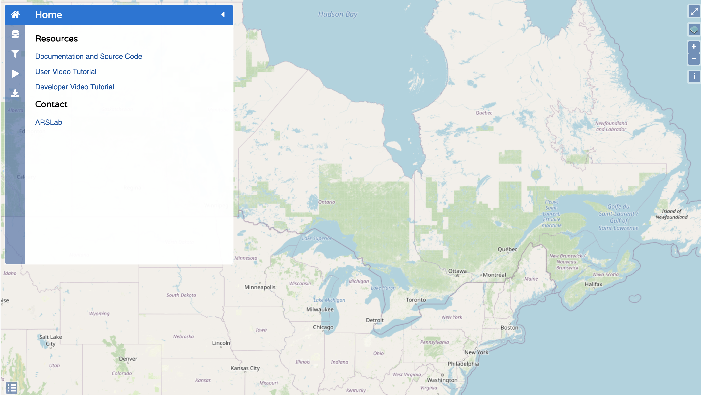
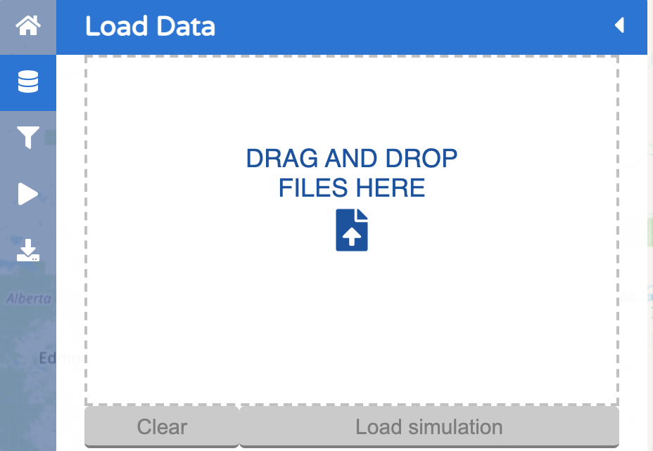
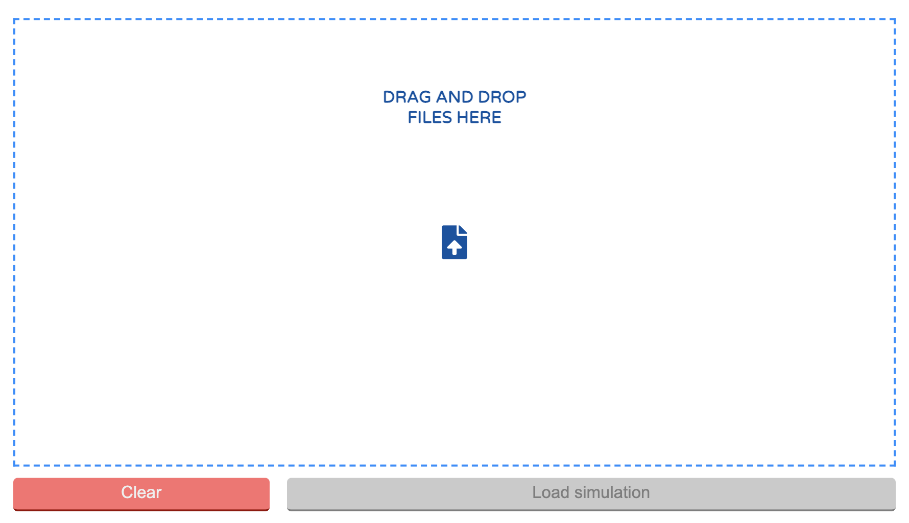
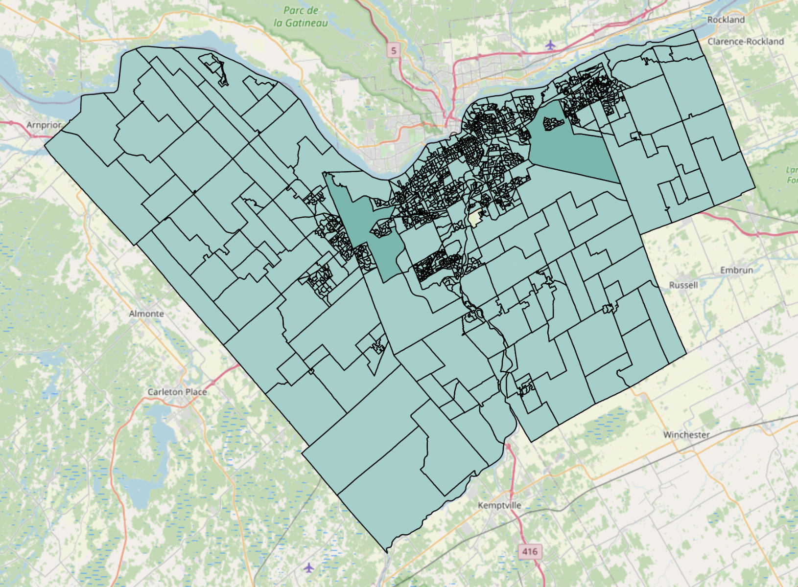
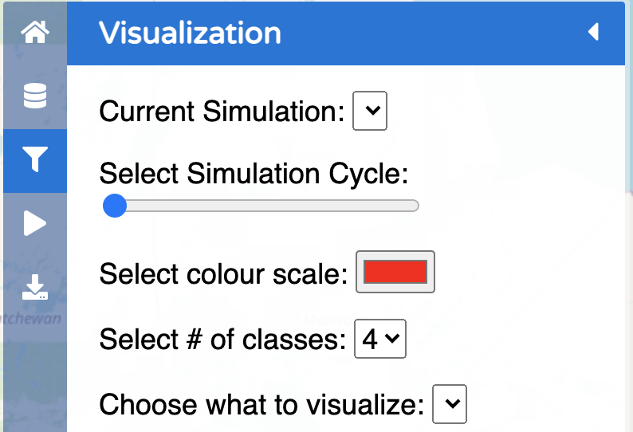
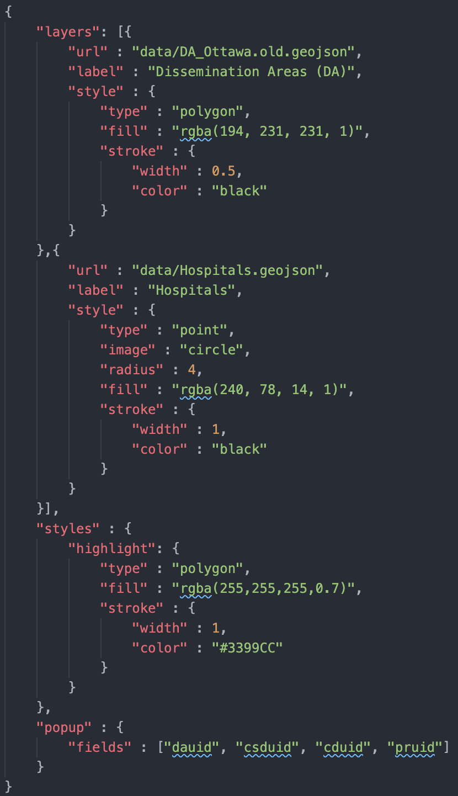
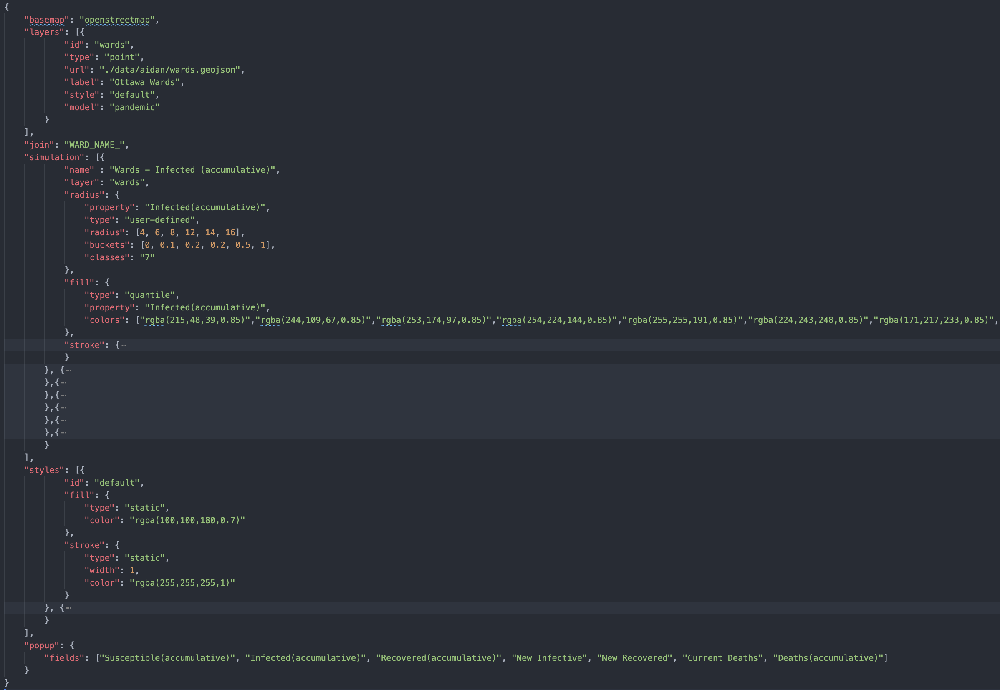

## Welcome

This repository will provide some background into the work I was a part of during my internship at ARSLab. The documentation for each work is held inside their respective repository. In some areas I've included PowerPoints to provide further background. 

## Types of Work 

### GIS

**[GIS Simulation Explorer (GSE)](https://github.com/staubibr/arslab-web/tree/master)**

A GIS environment based visualization for large scale spatial simulations on the web. 

###### Direct Links

- [GSE V1](https://github.com/staubibr/arslab-web/tree/master/app-gis) 
- [GSE V2](https://github.com/staubibr/arslab-web/tree/master/app-gis-v2)
  - [User Video Tutorial hosted on OneDrive (downloadable)](https://onedrive.live.com/embed?cid=A0BFB350AF1E6169&resid=A0BFB350AF1E6169%214146&authkey=AMTmXtr6czVS2nw)

###### End Goal 
- Have one version (V1 --> V2)
- GSE integration with DEVS Web Viewer
- Build library of "toy" models 
  - Requires server use, hence the move from V1 to V2
- Only visualize data within browser window view instead of loading everything 
- Improve thematic mapping 
  - Choropleth
  - Proportional 
  - Heatmap
- Refactor code and clean up UI


###### Differences between V1 and V2

- User Interface
  - V1
    [](image.png) 
  - V2
    [](image.png) 
- Data Loading 
  - V1 (in the sidebar)
    - Local (requires file chunking to read large files)
    [](image.png) 
  - V2 (in a separate page)
    - Server (fetch and / or send)
    [](image.png) 
- Simulations
  - V1 can support multiple simulations at the same time
    [](image.png) 
  - V2 only lets you upload one simulation per browser tab
    [](image.png) 
- Vector data
  - V1 only displays polygons
  [](image.png) 
  - V2 can display various geometries (polygon and centroids)
  [](image.png) 
- Customization 
  - V1
    - Limited customization of color and classification from user interface 
        [](image.png)
  - V2 
    - ```Application.json``` provided by programmers

        [](image.png)

    - ```Visualization.json``` provided by end users

        [](image.png) 

###### Additional Background

<iframe src="https://onedrive.live.com/embed?cid=A0BFB350AF1E6169&amp;resid=A0BFB350AF1E6169%214143&amp;authkey=AKVTpFmAwG8NJLI&amp;em=2&amp;wdAr=1.7777777777777777" width="610px" height="367px" frameborder="0">This is an embedded <a target="_blank" href="https://office.com">Microsoft Office</a> presentation, powered by <a target="_blank" href="https://office.com/webapps">Office</a>.</iframe>


**[Spatial Analysis Scenarios](https://github.com/omarkawach/spatial_analysis_scenarios)**

The goal was to develop a method that automates the generation of large-scale, spatial DEVS simulation models from GIS data. The repository explores various scenarios related to emergency services, disaster responses, and urban logistics. Having technical experience with Python, and QGIS was helpful.  

###### Additional Background

<iframe src="https://onedrive.live.com/embed?cid=A0BFB350AF1E6169&amp;resid=A0BFB350AF1E6169%214142&amp;authkey=AFX0N-NCkci5Irk&amp;em=2&amp;wdAr=1.7777777777777777" width="610px" height="367px" frameborder="0">This is an embedded <a target="_blank" href="https://office.com">Microsoft Office</a> presentation, powered by <a target="_blank" href="https://office.com/webapps">Office</a>.</iframe>

**[Spatial Autocorrelation Statistics](https://github.com/omarkawach/spatial_autocorrelation)**

Background into spatial autocorrelation statistics and use of GeoDa specialized software. The repository might be useful for reviewing the Zhong model.

### Autodesk Forge Viewer

**[COVID-BIM](https://github.com/SimulationEverywhere-Models/COVID-BIM)**

Used BIM data to simulate the spread of viral aerosol in buildings. See the old version in action at the [AEC Hackathon](https://devpost.com/software/covid-bim). See also [BIM-to-DEVS](https://devpost.com/software/bim-to-devs) for an even older version.

###### Additional Background (slightly out of date)

<iframe src="https://onedrive.live.com/embed?cid=A0BFB350AF1E6169&amp;resid=A0BFB350AF1E6169%214147&amp;authkey=AE6lf9_LlIQsEyY&amp;em=2&amp;wdAr=1.7777777777777777" width="610px" height="367px" frameborder="0">This is an embedded <a target="_blank" href="https://office.com">Microsoft Office</a> presentation, powered by <a target="_blank" href="https://office.com/webapps">Office</a>.</iframe>

*By Dr. Vinu Rajus*

**[COVID-GAME-APP](https://github.com/SimulationEverywhere-Models/COVID-game-app)**

A COVID game simulator as a real-world application that could train industry practitioners to improve ventilation or spatial design, make informed risk assessments, observe contact tracing, and discover new ways to conduct facilities management. Presented a demo at [Autodesk University Forge Hackathon 2020](https://forge.autodesk.com/blog/congrats-winners-forge-hackathon). 

### Miscellaneous

**[THREE.JS](https://github.com/omarkawach/threejs_grid)**

A quick playground for getting familiar with THREE.JS.

**[Geography Based Model](https://github.com/SimulationEverywhere-Models/Geography-Based-Model)**

A Geography based CELL-DEVS model. 


## Credits

[Carleton University - ARSLab](https://arslab.sce.carleton.ca/)

[Carleton University - SUSTAIN](https://sustain.sce.carleton.ca/)


